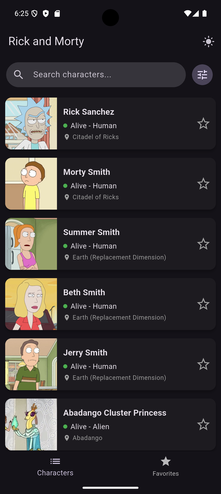
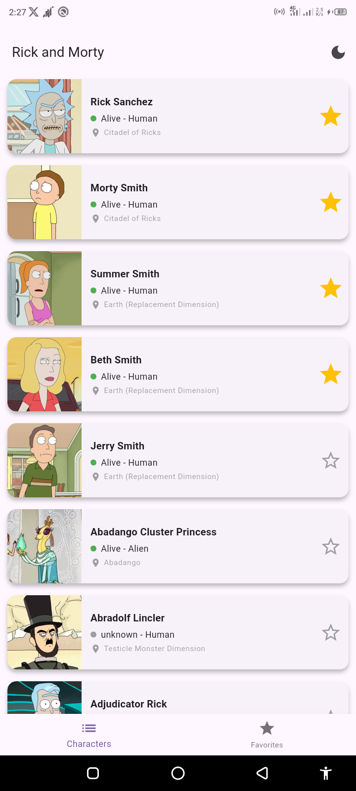

# 🥒 Rick and Morty Character App

    

A production-ready Flutter app built as a test assignment for **Effective Mobile**. Demonstrates Clean Architecture, Offline-First data handling, and advanced state management (BLoC). Fetches characters from the [Rick and Morty API](https://rickandmortyapi.com/) and includes theming, animations, caching, and offline support.

---

## 📱 App Preview

| Character List & Pagination | Favorites & Animations | Dark/Light Mode |
|:---:|:---:|:---:|
|  |  |  |

> Features: custom "Elastic Heart" animations, swipe-to-dismiss, infinite scrolling, and local favorites.

---

## 🚀 Key Features

- **Clean Architecture** — Separation of Domain, Data, and Presentation layers for testability and scalability.
- **Offline-First** — Uses Hive for caching so the app works without an internet connection.
- **State Management** — `flutter_bloc` for predictable state transitions and clear event handling.
- **Infinite Pagination** — Lazy loading of pages for smooth scrolling and performance.
- **Favorites System** — Local persistence via Hive with sorting and swipe-to-remove functionality.
- **UI/UX**:
    - Dark/Light theme switch via `ThemeCubit`.
    - Custom animations using `TweenAnimationBuilder` and `Dismissible`.
    - User-friendly error handling with SnackBars.

---

## 🛠 Tech Stack

| Category | Technology | Purpose |
| :--- | :--- | :--- |
| Framework | Flutter 3.x | Cross-platform UI toolkit |
| Language | Dart 3.x | Null-safe, strongly typed language |
| State Management | `flutter_bloc` | Business logic separation |
| Networking | `dio` | HTTP client with interceptors |
| Local DB | `hive` | Lightweight key-value cache |
| DI | `get_it` | Service locator for dependency injection |
| Codegen | `build_runner` | Generates Hive adapters and other boilerplate |
| Images | `cached_network_image` | Efficient remote image caching |

---

## 📂 Project Structure

Feature-first Clean Architecture layout:

```text
lib/
├── core/                     # Utilities: constants, exceptions
├── data/                     # Implementations (API, local DB)
│   ├── datasources/          # Remote (API) & local (Hive) sources
│   ├── models/               # DTOs with JSON serialization
│   └── repositories/         # Data layer implementations
├── domain/                   # Business rules (pure Dart)
│   ├── entities/             # Core business objects
│   └── repositories/         # Abstract repository contracts
├── presentation/             # UI & state
│   ├── bloc/                 # BLoCs and Cubits
│   ├── screens/              # Full-page widgets
│   └── widgets/              # Reusable components
├── main.dart                 # App entry & DI setup
└── injection_container.dart  # GetIt dependency registration
```

---

## ⚡ Getting Started

### Prerequisites
- Flutter (stable 3.x) — https://flutter.dev
- A connected device or emulator

Quick checks:
```bash
flutter --version
flutter doctor
```

### Install & run
1. Clone and open the project:
```bash
git clone https://github.com/inositols/Rick-and-Morty-API.git
cd rick_and_morty_app
```

2. Install dependencies:
```bash
flutter pub get
```

3. Generate code (Hive adapters, etc.):
```bash
flutter pub run build_runner build --delete-conflicting-outputs
# or for continuous generation
flutter pub run build_runner watch --delete-conflicting-outputs
```

4. Run the app:
```bash
flutter run
# or target a specific device
flutter run -d emulator-5554
```

### Platform notes
- Android: Ensure Android SDK & emulator (Android Studio) are configured.
- iOS: Build on macOS with Xcode; open `ios/Runner.xcworkspace` when needed.

### Useful commands
```bash
flutter analyze
dart format .
flutter test
```

### Troubleshooting
- If codegen fails:
```bash
flutter clean
flutter pub get
flutter pub run build_runner build --delete-conflicting-outputs
```
- Hive adapter issues: ensure model classes include proper annotations and imports, then re-run build_runner.

---

If you need a condensed README, a contributor guide, or CI examples, say which section to expand.
