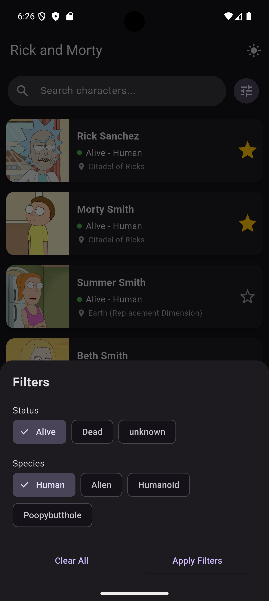
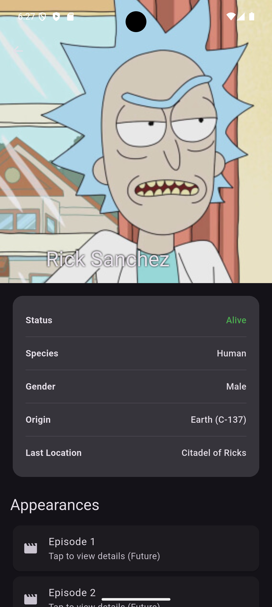
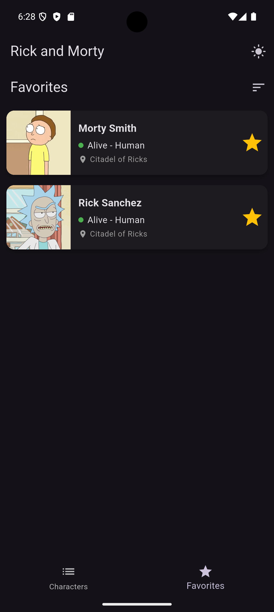

# 🥒 Rick and Morty Character App (Enhanced Edition)

    

This is a production-ready Flutter app demonstrating **Clean Architecture**, advanced **BLoC** patterns, and a modern UI/UX. Originally built as a test assignment, it has been enhanced with enterprise-level features like connectivity monitoring, debounced search, and skeleton loading.

---

## 📱 App Preview

| Character List | Search & Filters | Character Details | Favorites Screen |
|:---:|:---:|:---:|:---:|
|  |  |  |  |

---

## 🌟 New Enterprise Features

### 🔍 Advanced Search & Filtering
- **Real-time Search**: Instant search with **500ms debouncing** to optimize API calls.
- **Multi-Criteria Filtering**: Filter by Status (Alive, Dead, Unknown) and Species.
- **Optimized BLoC Logic**: Utilizes `bloc_concurrency` with `restartable()` for search/filters and `droppable()` for smooth pagination.

### 🖼️ Rich UI & UX
- **Hero Animations**: Seamless shared-element transitions from character cards to the detail view.
- **Skeleton Loaders**: Modern loading experience using `skeletonizer` instead of static spinners.
- **Sliver Detail Screen**: A beautiful, collapsible header with character background and full episode lists.
- **Pull-to-Refresh**: Intuitive data reloading on the main character list.

### 🔌 Connectivity Monitoring
- **Real-time Banner**: Integrated `connectivity_plus` to show a non-intrusive offline status banner.
- **Offline-First Resilience**: Gracefully falls back to Hive-cached data when no internet is available.

---

## 🛠 Tech Stack

| Category | Technology | Purpose |
| :--- | :--- | :--- |
| **Framework** | Flutter 3.x | UI Development |
| **Logic** | `flutter_bloc` | State Management & Concurrency |
| **Concurrency** | `bloc_concurrency` | Event transformation (Restartable/Droppable) |
| **Networking** | `dio` | API interaction |
| **Efficiency** | `stream_transform` | Search debouncing |
| **Persistence** | `hive` | Local object database |
| **UX** | `skeletonizer` | Content-aware loading states |
| **Testing** | `bloc_test`, `mocktail` | Unit testing |

---

## 📂 Project Structure

```text
lib/
├── core/                     # Constants, design tokens, and global utilities
├── data/                     # Data source implementations (Dio + Hive)
├── domain/                   # Pure business logic (Entities & Repository contracts)
├── presentation/             # UI Components & BLoC state logic
│   ├── bloc/                 # Feature-specific Blocs and Cubits
│   ├── screens/              # Top-level page widgets
│   └── widgets/              # Reusable UI components
└── injection_container.dart  # Dependency injection setup
```

---

## ⚡ Getting Started

1. **Install Dependencies**:
   ```bash
   flutter pub get
   ```

2. **Generate Models**:
   ```bash
   flutter pub run build_runner build --delete-conflicting-outputs
   ```

3. **Run the App**:
   ```bash
   flutter run
   ```

---

## 🧪 Testing

The app includes unit tests for core business logic. Run them using:
```bash
flutter test
```

---

## ✨ Design Philosophy
The app aims for a **premium** feel with:
- Harmonious color palettes.
- Fluid micro-animations.
- Content-first information hierarchy.
- Robust error handling and connectivity awareness.
